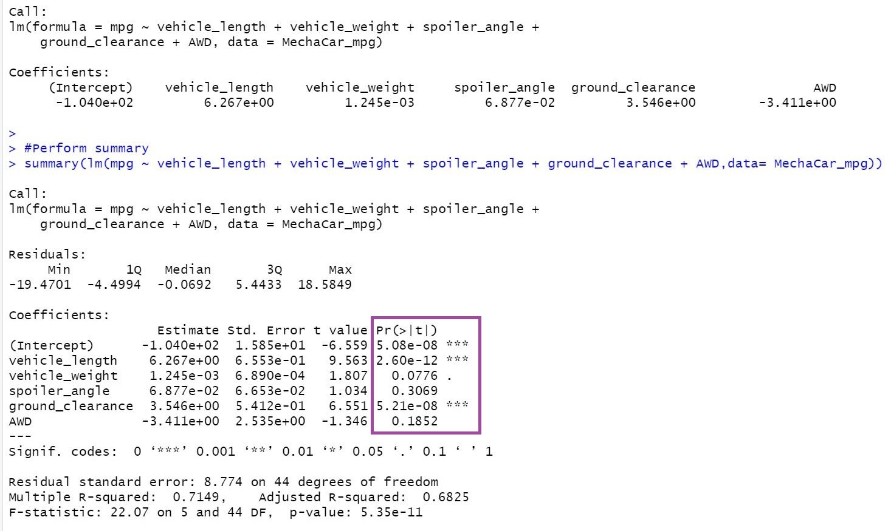
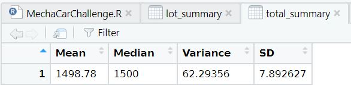
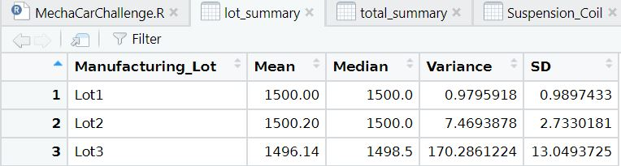
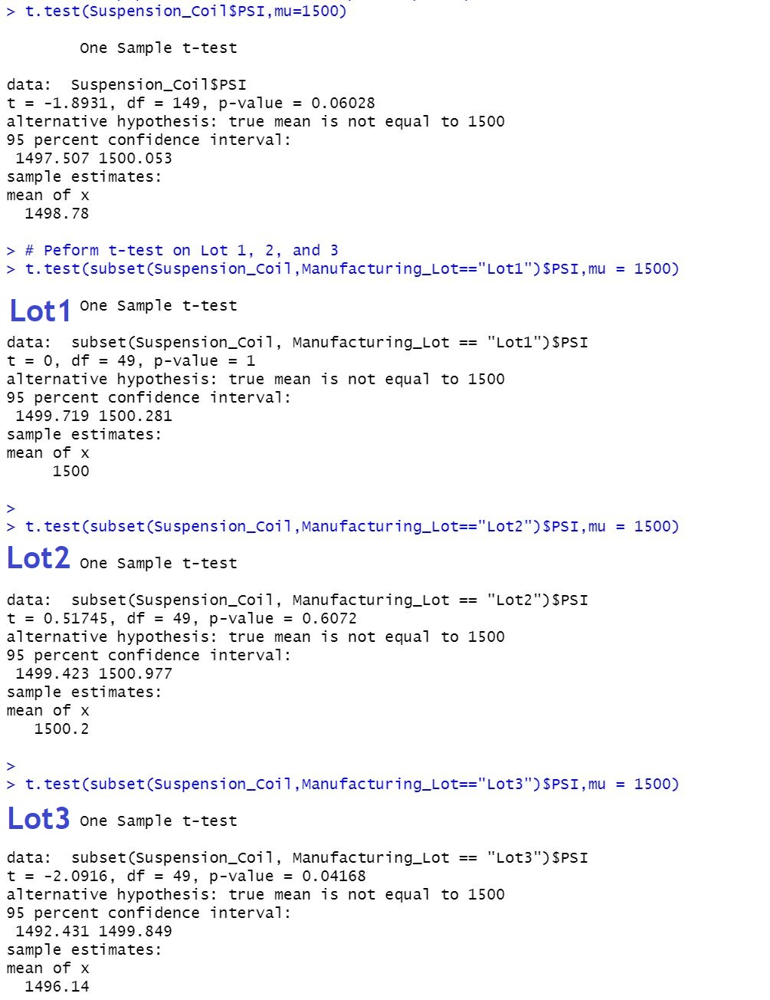

# MechaCar_Statistical_Analysis

## Linear Regression to Predict MPG
* Vehicle length and ground clearance provided a non-random amount of variance to the mpg values in the dataset. 

* The p-value of our linear regression is 5.21e-08 which is much smaller than the assumed significance level of .05%. 
Therefore, the slope of the linear module is not zero.

* The R-squared value is .715, which means that 71% of the regression model predicts accurately.  

## Summary Statistics on Suspension Coils
* In the total_summary dataframe, the variance of the suspension coil's PSI is 62.3 which falls within the range of the 
MechaCar's >100 pounds per suare inch specifications. However, when examining the lot_summary dataframe, both lot1 and 
lot2 have variances of much less than 100 pounds, while lot3 has a variance of 170 which exceeeds the MechaCar's design 
specs. Therefore the current manufacturing data meets the design specification for only Lots1 and Lots2, but not Lot3.

## T-Tests on Suspension Coils
* The first t-test has a sample collective mean of 1499 which is very similar to the other manufacturing lots, and a p-value 
of .06 which is NOT enough evidence to support rejecting the null hypothesis and it falls within the 95% confidence level. 

* Lot1: Lot1 has a statistically similar mean to the sample mean of 1500 with a p-value of 1. The p-value falls within the
95% confidence level, and because it is greater then the assumed significance leve of .05, there is not enough evidence to
reject the null hypothesis. 

* Lot2: Lot2 has a mean of 1500 which is statistically smiliar to the sample mean, and a p-value of .06 which is greater than
.05. Which means that the null hypothesis would not be rejected and is considered normally distributed. 

* Lot3: Lot3 has a mean of 1496 which is statistically similar to the sample mean and a p-value of .04. Because the p-value
is less than the assumed significance level of .05, there is enough evidence to reject the null hypothesis. 

## Study Design: MechaCar vs Competition